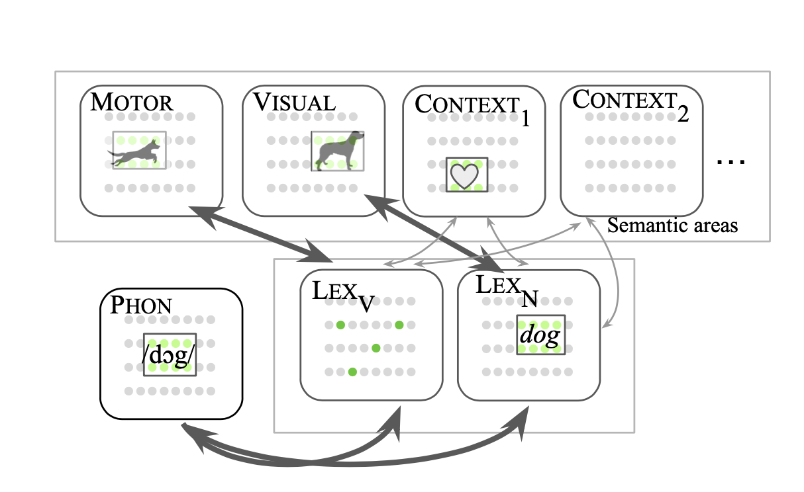

# Modern Irish Literature for Neural Assemblies

Applying the Assembly Calculus / NEMO language model to *Finnegans Wake*.

NEMO (Papadimitriou, Mitropolsky et al.) models language as assemblies of neurons running a
few operations — project, associate, merge — over a Hebbian network. It was built and tested
on a clean two-word toy language. The Wake breaks almost every assumption behind it: words
aren't atomic or stable, there's no sensorimotor grounding, the noun/verb split is a mess,
and you can't ignore the function words. So it's a good place to find out where the model
actually fails, and why.

The clearest thing that came out of this is about NEMO rather than about Joyce, so I'll start
there.



PHON holds a word's phonology; LEXₙ and LEXᵥ are the noun and verb lexical hubs; MOTOR,
VISUAL and the CONTEXT areas are semantic/sensorimotor. Training binds a word's PHON assembly
to its hub and its context assemblies through Hebbian plasticity. (Figure after Mitropolsky &
Papadimitriou.)

## Hebbian collapse under class imbalance

Train a NEMO context area on imbalanced data and the common class takes over: its assembly
fires for everything and the rare classes fall to near-zero recall. That part is a known,
reproducible failure.

What I found is that it's mostly a missing normalisation step, not a real limit of the
substrate. Standardise each context slot's drive against held-out statistics before reading
off a winner — no retraining, nothing changed in nemo-core — and the rare classes come back.
On the collapsed run, foreign-language detection goes from 0.21 to 0.32 (mean over five
seeds, and up in every one); macro-F1 from 0.23 to 0.29.

The fix ([context_inhibition.py](src/context_inhibition.py)) is only a read-out change, but
it's the evaluator-side version of the lateral inhibition that Mitropolsky & Papadimitriou
(2025) already put between MOOD slots, so it points at a concrete change you could make inside
the engine. None of it depends on the Wake; it should apply to any NEMO model trained on
imbalanced input, which acquisition data always is.

The obvious caveats: one chapter, 55 foreign test lines, five seeds. The direction holds in
every seed (sign test p ≈ 0.03); the magnitude still varies seed to seed. Numbers are in
[results/summary/](results/summary/finished_science_summary.json) and the full write-up is in
[RESULTS.md](RESULTS.md#idea-2--multilingual-context-areas-phonotactic-attribution).

## The two experiments

Both use NEMO to measure something about the Wake. The collapse result above fell out of the
first one.

### Multilingual phonotactic attribution

Make each source language in the Wake its own CONTEXT_L area, feed tokens into PHON as phoneme
bigrams, and let CONTEXT_L learn which sound patterns belong to which language. Then test on
held-out [FWEET](http://www.fweet.org)-tagged lines: does NEMO assign them to the right
languages better than a frequency baseline or a classical bigram LangID?

Not really. Averaged over five seeds it matches the classical baseline on foreign-language
lines (28% vs about 22%, well inside a wide seed spread of ±8 points) but doesn't reliably
beat it. The single-seed 41% I first quoted was a lucky draw. Tightening the baseline so it sees exactly what NEMO sees
(deduping its bigrams) only helps the baseline. So the interesting part of this experiment
isn't the attribution — it's the collapse behaviour it exposed.

### Portmanteau decomposition

Build PHON out of phoneme or morpheme n-grams so a held-out portmanteau like *passencore*
partly lights up the hubs of its parts (*pass*, *encore*). The overlap pattern is the model's
guess at the decomposition, which you can score against the scholarly (FWEET) and segmenter
decompositions.

My first pass said order helped a lot: bigram PHON beat bag-of-phonemes by about 64% on
FlatCat. That turned out to be mostly a confound — the bigram run had trained roughly four
times as hard. Run the two at the same settings and the gap nearly vanishes; bigram is worse
on three of the four segmenters and only ~7% ahead on FlatCat. There's a small real order
effect, but only there, and the case for building the full sequence engine is now weak.

### Not done yet: voice segmentation

Treating each Wake voice (HCE, ALP, Shem, Shaun…) as a bundle of context assemblies and
segmenting passages by which bundle wins. It's designed and the annotations are in
`data/annotations/`, but I haven't run it. There's a sketch in [RESULTS.md](RESULTS.md).

## Running it

```
git submodule update --init      # nemo-core, the engine
pip install -e .
export PYTHONPATH=.:nemo-core
```

A multilingual run holds 0.7–1.5 GB of float32 weights, so on a 16 GB machine don't start
more than two or three at once or they swap and crawl (I learned this the slow way).

```
# one attribution run (balanced, ~50 min)
python3 src/replicate_multilingual_context.py \
    --lexicon lexicons/i6_multilingual_top5.json --max-per-lang 25 --rounds 10 --seed 0

# classical baseline; --dedup-line makes it see exactly NEMO's input
python3 src/baseline_attribution.py \
    --lexicon lexicons/i6_multilingual_top5.json --max-per-lang 25 --dedup-line \
    --output results/baselines/cap25_dedup.json

# the collapse-recovery result, across seeds
python3 src/context_inhibition.py --aggregate --inputs results/mlctx_*/results.json

# portmanteau: bag vs bigram at matched settings (--ngram 2 for bigram)
python3 src/replicate_ngram_phon.py \
    --lexicon lexicons/ep1_phoneme_gallery.json --ngram 1 --beta 0.03 --rounds 10 --proj-rounds 1
python3 src/fweet_compare.py --mode activation \
    --results results/ngram1_phon_*/results.json --lexicon lexicons/ep1_phoneme_gallery.json
```

## Layout

- `src/` — replication and analysis scripts
- `nemo-core/` — the Assembly Calculus engine, a submodule ([github.com/dmitropolsky/assemblies](https://github.com/dmitropolsky/assemblies))
- `lexicons/` — prepared experiment inputs
- `shared/` — corpus / FWEET / IPA loaders
- `data/` — POS hypotheses and sigla annotations (raw text and IPA come from the data repo, below)
- `results/summary/` — the JSONs behind the numbers above
- `RESULTS.md` — full write-ups; `docs/history.md` — older session log

## Data

The raw corpus text, the derived IPA (`data/ipa/`), and the source PDFs (`papers/`) are kept
out of git and come from the companion `finnegans-wake` repo. What's committed —
`data/pos/`, `data/annotations/`, `lexicons/`, `results/summary/` — is enough to check the
reported numbers; rebuilding the lexicons from scratch needs the data repo.

## References

- Papadimitriou, Vempala, Mitropolsky, Collins & Maass, "Brain computation by assemblies of
  neurons," *PNAS* 117(25), 2020.
- Mitropolsky, Collins & Papadimitriou, "The architecture of a biologically plausible
  language organ," 2021 (`papers/assemblies_biological_language_organ.pdf`).
- Mitropolsky & Papadimitriou, "Simulated Language Acquisition in a Biologically Realistic
  Model of the Brain," arXiv:2507.11788, 2025.
- Dabagia, Papadimitriou & Vempala, "Computation with sequences of assemblies," *Neural
  Computation*, 2024.
- Joyce, *Finnegans Wake*, 1939.
- McHugh, *Annotations to Finnegans Wake* and *The Sigla of Finnegans Wake*.
- Slepon, *Finnegans Wake Extensible Elucidation Treasury* (FWEET), http://www.fweet.org
